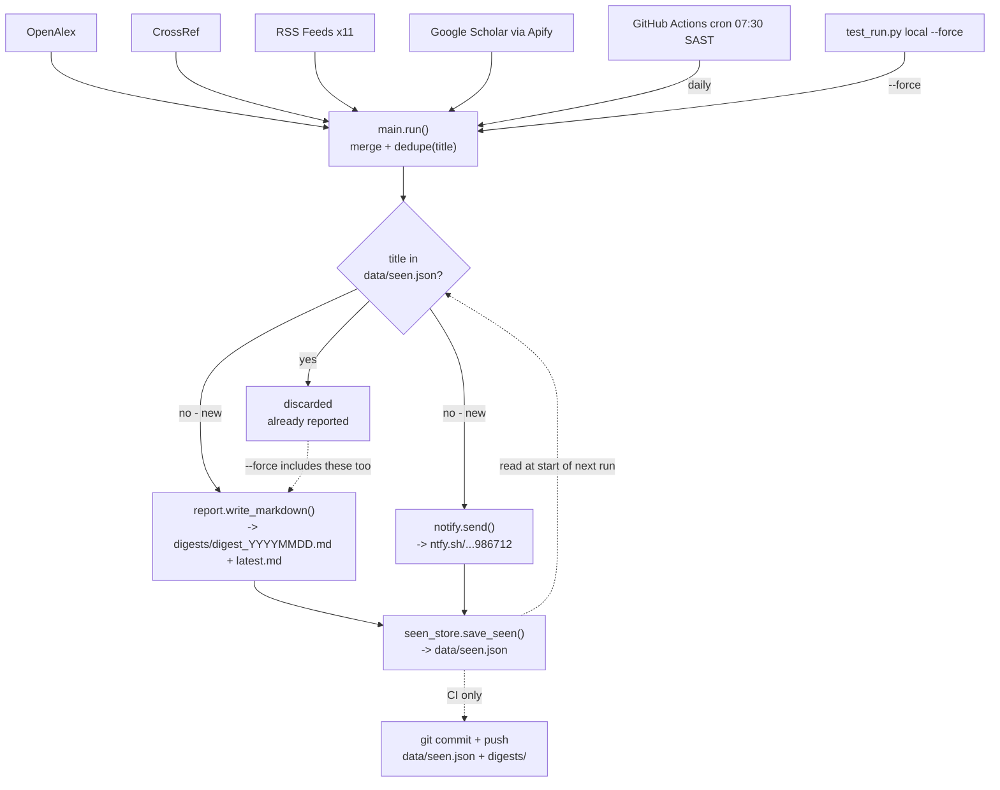

# Digest Pipeline

Every source funnels into `main.run()`, which dedupes by title and checks
each one against `data/seen.json`. Only new titles reach the report and the
ntfy push; already-seen ones are dropped — except when `test_run.py` runs
with `--force`, which reroutes them back in too, so you always get a
notification while testing. The state file is rewritten every run, which is
what tomorrow's check reads against.
